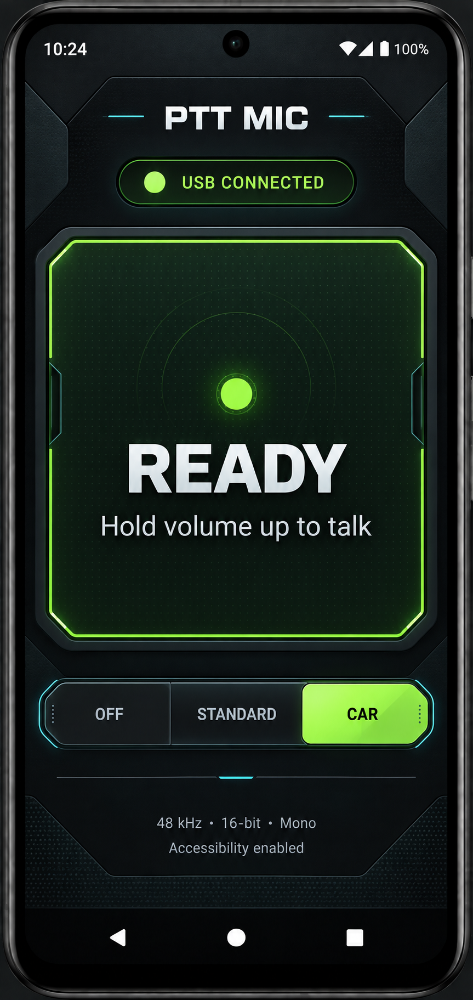
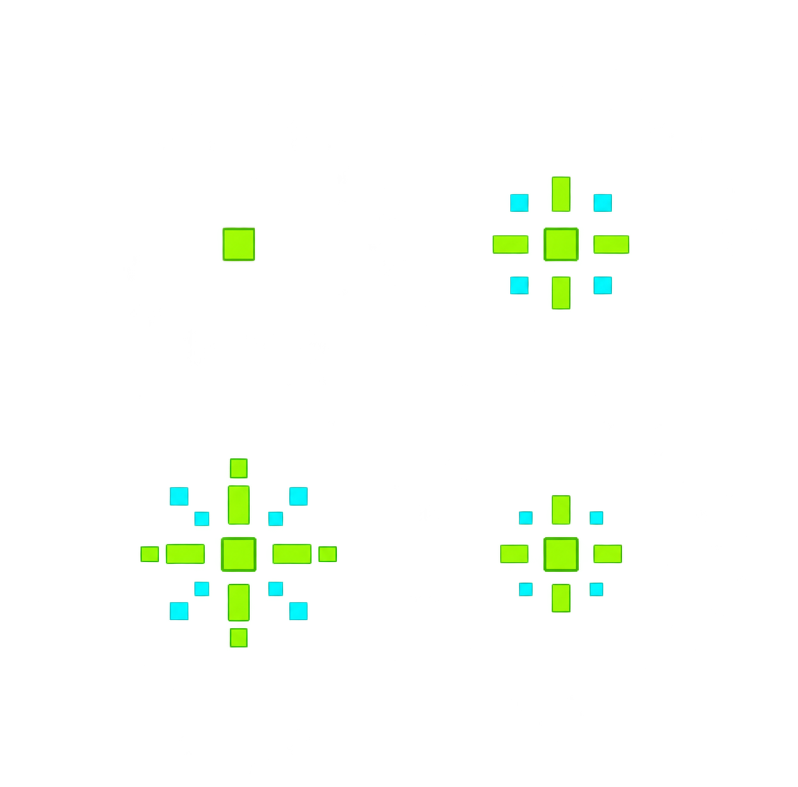

# V1 UI concept

The home-screen direction is a compact, futuristic PTT console: dark graphite,
high-contrast lime/cyan accents, a clear ready/transmitting state, and no touch-to-talk
control that could leave the microphone open accidentally.

The four-frame pixel pulse is a visual reference. The Android UI currently draws a
minimal pixel-pulse indicator in Compose while the physical PTT key is held; it stops
when the key is released.

The mockup is a design reference, not a screenshot of the current app. Keep V1 focused:
connect/disconnect, connection mode, processing mode, key test, and live PTT state.
